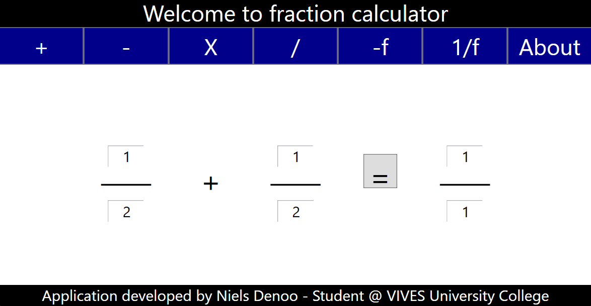
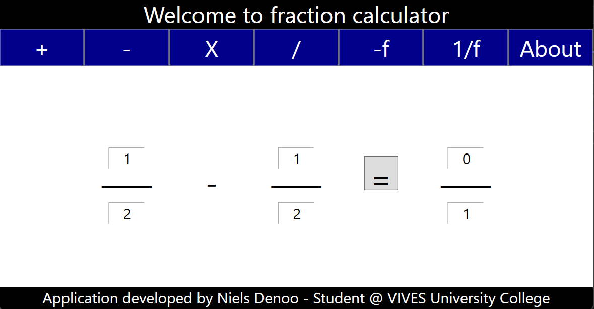
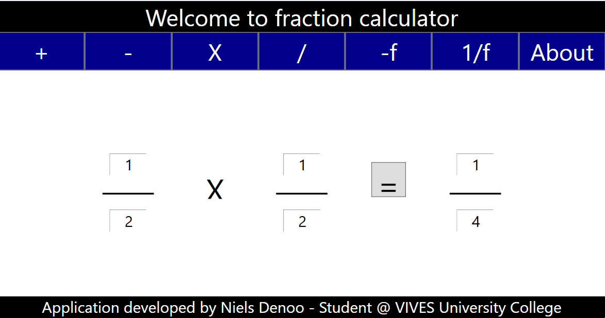
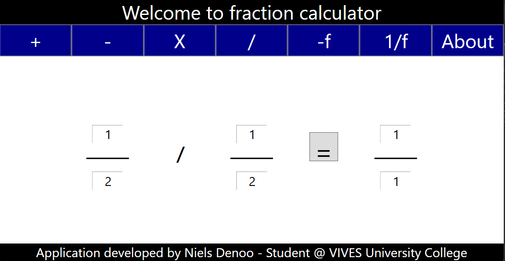
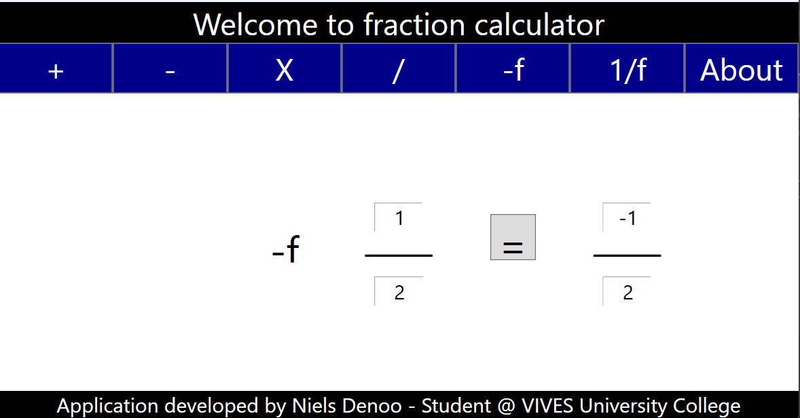
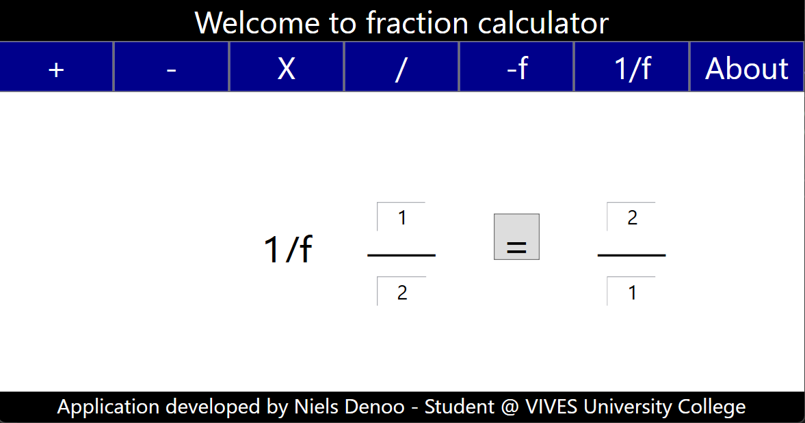
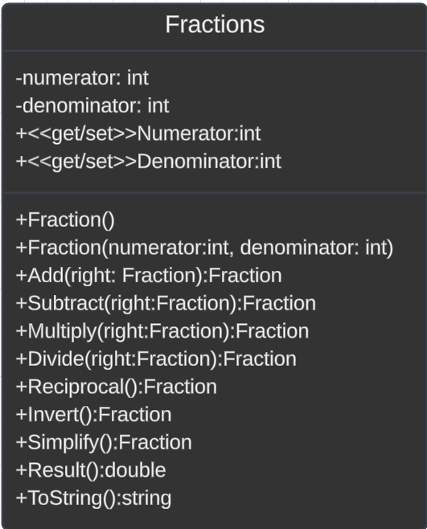

# Fraction Calculator

## Description

This app was created to solve simple math problems of fractions. The solution consist of 4 items with the most important one being the Fractions class. With it u can use mathematical operators in console applications.

The app has 3 other parts which are:

- Unit tests to test if everything in the fraction class works
- A console application to show how the class works
- A WPF application which allows the user to solve basic math problems.

## Author

This app is made by Niels Denoo during his studies at VIVES Brugge 2024.

## Screenshots

Here are some screenshots of the WPF application

This is the add option which adds 2 fractions together?

This is the subtract option which subtracts the second fraction from the first.

This is the multiply option which multiplies the 2 fractions.

This is the divide option which divides the 2 fractions.

This is the invert option which makes a fraction negative or if already negative makes it positive.

Last is the reciprocal option which switches the place of the numerator and denominator.

## Setup and usage

To use this application u need to install Visual Studio. You can do this by following [Link](https://visualstudio.microsoft.com/vs/community/). After installation u need to run Fractions.sln in visual studio.

You can also run it by running the WPFFractionCalculator.exe

## Unit tests

The unit tests are used to test if the all the methods in the fraction class work.

## UML diagram

## Future improvements

- Change to the lay-out of the WPF
- Make it possible to add multiple operations at once
- Implement more operations to do on the fractions